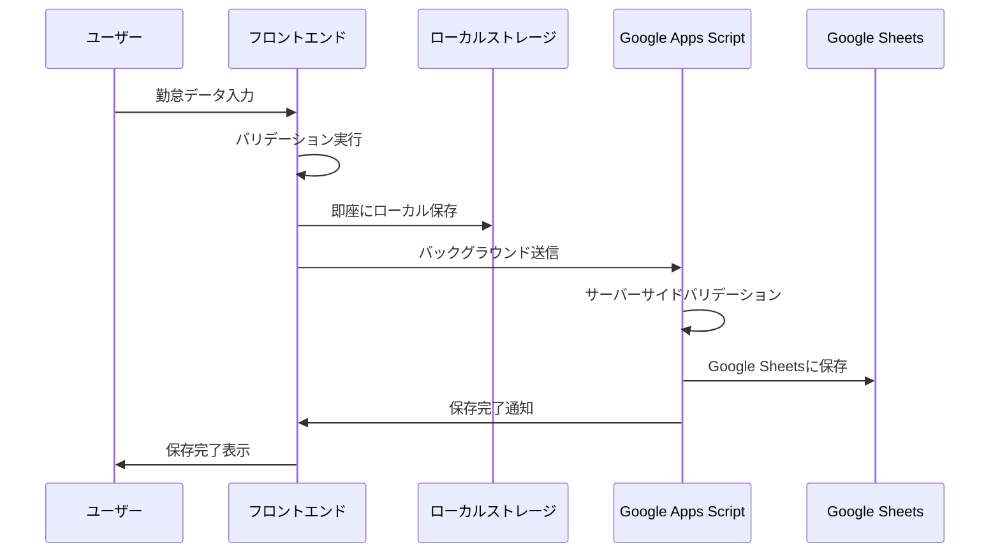
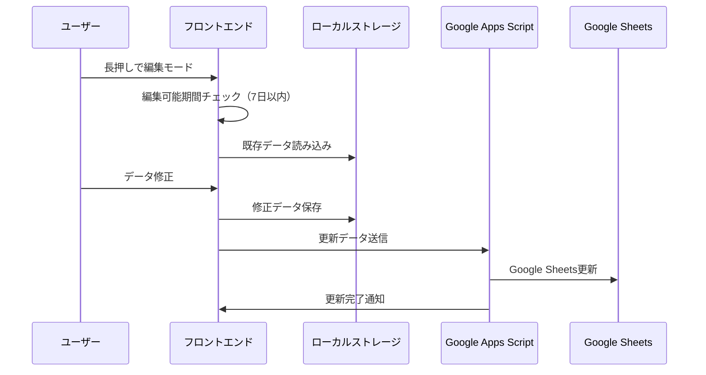
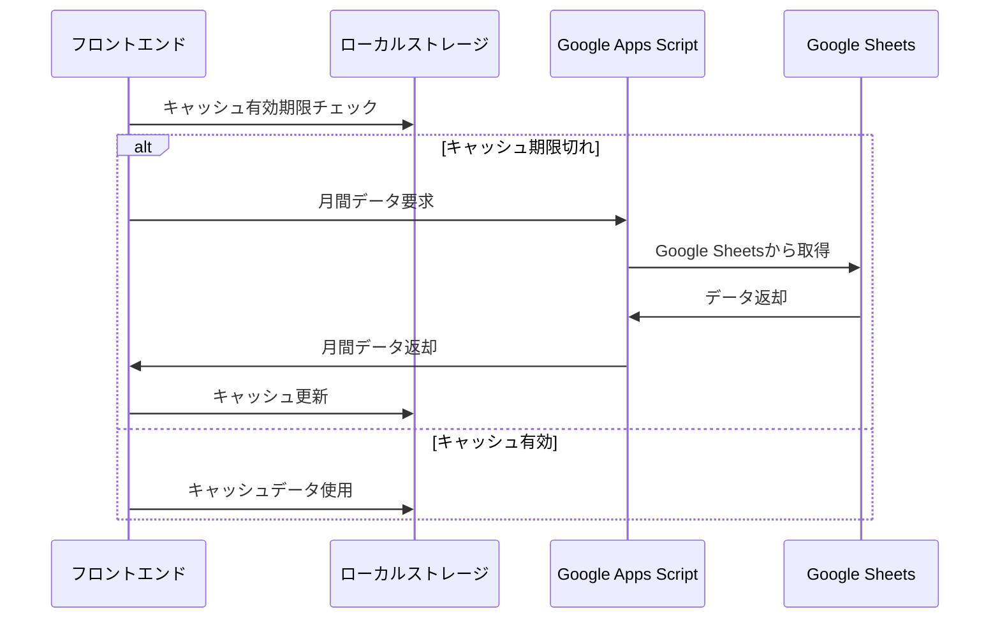

# 勤怠管理アプリ - データ管理ドキュメント

## 📋 目次

1. [データ構造](#データ構造)
2. [データ保存場所と期間](#データ保存場所と期間)
3. [データライフサイクル](#データライフサイクル)
4. [データ同期戦略](#データ同期戦略)
5. [キャッシュ戦略](#キャッシュ戦略)
6. [データバリデーション](#データバリデーション)
7. [データセキュリティ](#データセキュリティ)
8. [バックアップ・復旧](#バックアップ復旧)

## データ構造

### 勤怠データの型定義

#### KintaiEntry（勤怠エントリ）

```typescript
interface KintaiEntry {
  id: string; // 一意識別子（UUID）
  date: string; // 日付（YYYY-MM-DD形式）
  startTime: string | null; // 出勤時間（HH:mm形式）
  endTime: string | null; // 退勤時間（HH:mm形式）
  breakTime: number; // 休憩時間（分）
  workLocation: string | null; // 勤務場所
  notes: string; // 備考
  isCompleted: boolean; // 入力完了フラグ
  createdAt: string; // 作成日時（ISO 8601）
  updatedAt: string; // 更新日時（ISO 8601）
  syncStatus: SyncStatus; // 同期状態
  version: number; // バージョン（楽観的ロック用）
}
```

#### SyncStatus（同期状態）

```typescript
type SyncStatus =
  | "pending" // 同期待ち
  | "syncing" // 同期中
  | "synced" // 同期完了
  | "error" // 同期エラー
  | "conflict"; // 競合発生
```

#### MonthlyData（月間データ）

```typescript
interface MonthlyData {
  year: number; // 年
  month: number; // 月（1-12）
  entries: KintaiEntry[]; // 勤怠エントリ配列
  totalWorkingDays: number; // 総勤務日数
  totalWorkingHours: number; // 総勤務時間（時間）
  lastUpdated: string; // 最終更新日時
  cacheExpiry: string; // キャッシュ有効期限
}
```

#### UserProfile（ユーザープロファイル）

```typescript
interface UserProfile {
  userId: string; // ユーザーID
  username: string; // ユーザー名
  email: string; // メールアドレス
  workLocations: string[]; // 利用可能な勤務場所
  defaultBreakTime: number; // デフォルト休憩時間（分）
  timezone: string; // タイムゾーン
  preferences: UserPreferences; // ユーザー設定
  lastLoginAt: string; // 最終ログイン日時
}
```

#### UserPreferences（ユーザー設定）

```typescript
interface UserPreferences {
  theme: "light" | "dark" | "auto"; // テーマ設定
  language: "ja" | "en"; // 言語設定
  timeFormat: "12h" | "24h"; // 時間表示形式
  autoSync: boolean; // 自動同期有効/無効
  notifications: {
    enabled: boolean; // 通知有効/無効
    reminderTime: string; // リマインダー時刻
    weeklyReport: boolean; // 週次レポート通知
  };
}
```

### Google Sheets連携データ形式

#### スプレッドシート構造

```
シート名: "勤怠データ_{YYYY}"

| A列    | B列      | C列      | D列      | E列      | F列    | G列  | H列      | I列      |
|--------|----------|----------|----------|----------|--------|------|----------|----------|
| 日付   | 出勤時間 | 退勤時間 | 休憩時間 | 勤務場所 | 備考   | 完了 | 作成日時 | 更新日時 |
| DATE   | START    | END      | BREAK    | LOCATION | NOTES  | DONE | CREATED  | UPDATED  |
```

#### データ変換ルール

```typescript
// フロントエンド → Google Sheets
const toSheetsFormat = (entry: KintaiEntry): string[] => [
  entry.date, // A列: 日付
  entry.startTime || "", // B列: 出勤時間
  entry.endTime || "", // C列: 退勤時間
  entry.breakTime.toString(), // D列: 休憩時間
  entry.workLocation || "", // E列: 勤務場所
  entry.notes, // F列: 備考
  entry.isCompleted ? "TRUE" : "FALSE", // G列: 完了フラグ
  entry.createdAt, // H列: 作成日時
  entry.updatedAt, // I列: 更新日時
];

// Google Sheets → フロントエンド
const fromSheetsFormat = (row: string[]): KintaiEntry => ({
  id: generateId(row[0]), // 日付から生成
  date: row[0],
  startTime: row[1] || null,
  endTime: row[2] || null,
  breakTime: parseInt(row[3]) || 0,
  workLocation: row[4] || null,
  notes: row[5] || "",
  isCompleted: row[6] === "TRUE",
  createdAt: row[7],
  updatedAt: row[8],
  syncStatus: "synced",
  version: 1,
});
```

### 既存のデータ構造（参考）

#### KintaiData インターフェース（既存）

```typescript
export interface KintaiData {
  date: string; // 日付 (YYYY-MM-DD形式)
  startTime: string; // 出勤時間 (HH:mm形式)
  breakTime: string; // 休憩時間 (HH:mm形式)
  endTime: string; // 退勤時間 (HH:mm形式)
  location: string; // 勤務場所
  workingTime?: string; // 勤務時間 (HH:mm形式、自動計算)
}
```

#### KintaiRecord インターフェース（既存）

```typescript
export interface KintaiRecord {
  date: string;
  startTime: string;
  breakTime: string;
  endTime: string;
  location: string;
  workingTime?: string;
  // サーバーサイドで追加される可能性のあるフィールド
  userId?: string;
  timestamp?: string;
  status?: "draft" | "submitted" | "approved";
}
```

#### フォーム状態管理（既存）

```typescript
export interface KintaiFormState {
  date: string; // 現在選択中の日付
  startTime: string; // 出勤時刻
  breakTime: string; // 休憩時間
  endTime: string; // 退勤時刻
  location: string; // 勤務場所
  isSaved: boolean; // 現在の日付が保存済みかどうか
  isEditing: boolean; // 編集モード中かどうか
  touchStartTime: number; // 長押し開始時間
}
```

### バリデーション定義（既存）

```typescript
export interface ValidationErrors {
  date?: string; // 日付エラーメッセージ
  startTime?: string; // 出勤時間エラーメッセージ
  endTime?: string; // 退勤時間エラーメッセージ
  general?: string; // 全般的なエラーメッセージ
}
```

## 💾 データ保存場所と期間

### ローカルストレージ（一時保存・オフライン対応）

#### 保存場所

- **ブラウザ**: `localStorage`
- **容量制限**: 約5-10MB（ブラウザ依存）
- **有効期限**: ブラウザデータクリアまで永続

#### 保存データ

```typescript
// 認証情報
const TOKEN_KEY = "kintai_token";
const USER_ID_KEY = "kintai_user_id";
const USER_NAME_KEY = "kintai_user_name";
const SHEET_ID_KEY = "kintai_spreadsheet_id";

// 月間データキャッシュ
const MONTHLY_DATA_KEY = "kintai_monthly_data";
const MONTHLY_DATA_TIMESTAMP_KEY = "kintai_monthly_data_timestamp";

// 個別勤怠データ
const KINTAI_DATA_PREFIX = "kintai_data_"; // + YYYY-MM-DD
```

#### キャッシュ戦略

- **有効期限**: 30分（1800秒）
- **更新タイミング**:
  - 手動リフレッシュ
  - アプリ起動時
  - データ保存後
- **容量管理**: 古いデータの自動削除（3ヶ月以上前）

### Google Sheets（永続化・バックアップ）

#### データ構造

##### ユーザー管理シート

| 列  | フィールド    | 型       | 説明                              |
| --- | ------------- | -------- | --------------------------------- |
| A   | userId        | string   | ユーザーID（一意）                |
| B   | userName      | string   | ユーザー名                        |
| C   | email         | string   | メールアドレス                    |
| D   | spreadsheetId | string   | 個人用スプレッドシートID          |
| E   | createdAt     | datetime | 作成日時                          |
| F   | lastLoginAt   | datetime | 最終ログイン日時                  |
| G   | status        | string   | アカウント状態（active/inactive） |

##### 月次勤怠データシート（YYYY-MM形式）

| 列  | フィールド  | 型       | 説明                          |
| --- | ----------- | -------- | ----------------------------- |
| A   | date        | date     | 日付（YYYY-MM-DD）            |
| B   | startTime   | time     | 出勤時間（HH:mm）             |
| C   | breakTime   | time     | 休憩時間（HH:mm）             |
| D   | endTime     | time     | 退勤時間（HH:mm）             |
| E   | location    | string   | 勤務場所                      |
| F   | workingTime | time     | 勤務時間（自動計算）          |
| G   | createdAt   | datetime | 作成日時                      |
| H   | updatedAt   | datetime | 更新日時                      |
| I   | status      | string   | ステータス（draft/submitted） |

#### データ保持期間

- **アクティブデータ**: 無期限保持
- **アーカイブ**: 7年間保持（労働基準法準拠）
- **バックアップ**: Google Drive自動バックアップ

## 🔄 データライフサイクル

### 1. データ作成フロー



### 2. データ編集フロー



### 3. データ同期フロー



### 4. データアーカイブフロー

- **トリガー**: 月次バッチ処理
- **対象**: 3ヶ月以上前のデータ
- **処理**:
  1. アーカイブシートに移動
  2. アクティブシートから削除
  3. ローカルキャッシュクリア

## 🔍 入力済み判定アルゴリズム

### レガシー判定ロジック

```typescript
// 従来の判定方式
const isDateEntered = (date: Date): boolean => {
  const kintaiData = getKintaiDataByDate(formatDate(date));
  return !!(
    kintaiData?.startTime &&
    kintaiData?.endTime &&
    kintaiData?.location
  );
};
```

### 新判定ロジック（entryStatusManager）

```typescript
// 新しい判定方式（Phase 2で並行運用中）
const isDateEnteredNew = (date: Date): boolean => {
  return entryStatusManager.isDateEntered(date);
};

// 内部実装
class EntryStatusManager {
  private cache: Map<string, boolean> = new Map();

  isDateEntered(date: Date): boolean {
    const dateKey = this.formatDateKey(date);

    // キャッシュチェック
    if (this.cache.has(dateKey)) {
      return this.cache.get(dateKey)!;
    }

    // 必須フィールドチェック
    const data = this.getKintaiData(dateKey);
    const isEntered = this.validateRequiredFields(data);

    // キャッシュ更新
    this.cache.set(dateKey, isEntered);
    return isEntered;
  }

  private validateRequiredFields(data: KintaiData | null): boolean {
    if (!data) return false;

    return !!(
      data.startTime?.trim() &&
      data.endTime?.trim() &&
      data.location?.trim() &&
      this.isValidTimeFormat(data.startTime) &&
      this.isValidTimeFormat(data.endTime)
    );
  }
}
```

### 並行運用での比較機能

```typescript
const compareLogics = (date: Date) => {
  const legacy = isDateEntered(date);
  const newLogic = isDateEnteredNew(date);

  return {
    legacy,
    new: newLogic,
    match: legacy === newLogic,
  };
};
```

## 🛡️ データ整合性保証

### バリデーション層

#### フロントエンド バリデーション

```typescript
const validateKintaiData = (data: KintaiData): ValidationErrors => {
  const errors: ValidationErrors = {};

  // 日付チェック
  if (!data.date || isDateTooOld(data.date)) {
    errors.date = "編集可能期間を超えています（7日以内）";
  }

  // 時刻チェック
  if (!data.startTime) {
    errors.startTime = "出勤時間は必須です";
  }

  if (!data.endTime) {
    errors.endTime = "退勤時間は必須です";
  }

  // 時刻の前後関係チェック
  if (data.startTime && data.endTime) {
    if (!isTimeBeforeOrEqual(data.startTime, data.endTime)) {
      errors.endTime = "退勤時間は出勤時間より後である必要があります";
    }
  }

  return errors;
};
```

#### サーバーサイド バリデーション

- **重複チェック**: 同一日付の重複登録防止
- **権限チェック**: ユーザー権限による編集制限
- **データ形式チェック**: 型安全性の再確認

### エラーハンドリング

#### ネットワークエラー

```typescript
const handleNetworkError = async (error: Error, retryCount = 0) => {
  if (retryCount < 3) {
    // 指数バックオフでリトライ
    await new Promise((resolve) =>
      setTimeout(resolve, Math.pow(2, retryCount) * 1000)
    );
    return retry(retryCount + 1);
  }

  // ローカルストレージに保存して後で同期
  await saveToLocalForLaterSync(data);
  throw new Error("ネットワークエラー: 後で自動同期されます");
};
```

#### データ競合解決

```typescript
const resolveDataConflict = (localData: KintaiData, serverData: KintaiData) => {
  // 最終更新時刻による解決
  if (localData.updatedAt > serverData.updatedAt) {
    return localData; // ローカルが新しい
  }
  return serverData; // サーバーが新しい
};
```

## 📈 パフォーマンス最適化

### キャッシュ戦略

#### メモリキャッシュ

- **対象**: 現在月のデータ
- **有効期限**: セッション中
- **更新**: データ変更時に無効化

#### ディスクキャッシュ

- **対象**: 過去3ヶ月のデータ
- **有効期限**: 30分
- **圧縮**: JSON圧縮で容量削減

### 遅延読み込み

```typescript
// 月間データの遅延読み込み
const useDeferredMonthlyData = (year: number, month: number) => {
  const [data, setData] = useState<KintaiRecord[]>([]);
  const [loading, setLoading] = useState(false);

  const deferredYear = useDeferredValue(year);
  const deferredMonth = useDeferredValue(month);

  useEffect(() => {
    loadMonthlyData(deferredYear, deferredMonth);
  }, [deferredYear, deferredMonth]);

  return { data, loading };
};
```

### バックグラウンド同期

```typescript
// Service Workerでのバックグラウンド同期
self.addEventListener("sync", (event) => {
  if (event.tag === "kintai-sync") {
    event.waitUntil(syncPendingData());
  }
});

const syncPendingData = async () => {
  const pendingData = await getPendingDataFromIndexedDB();

  for (const data of pendingData) {
    try {
      await syncToServer(data);
      await removePendingData(data.id);
    } catch (error) {
      console.error("Sync failed:", error);
      // 次回同期時に再試行
    }
  }
};
```

## 🔒 データセキュリティ

### 暗号化

- **通信**: HTTPS/TLS 1.3
- **保存**: Google Sheets標準暗号化
- **ローカル**: ブラウザ標準暗号化

### アクセス制御

- **認証**: トークンベース認証
- **認可**: ユーザー別データ分離
- **監査**: アクセスログ記録

### プライバシー保護

- **データ最小化**: 必要最小限のデータのみ収集
- **匿名化**: 統計データの匿名化
- **削除権**: ユーザーによるデータ削除要求対応

---

**最終更新**: 2025-01-27  
**バージョン**: 1.0.0  
**関連ドキュメント**:

- [システム概要](./SYSTEM_OVERVIEW.md)
- [API仕様](./API_SPECIFICATION.md)
- [ビジネスロジック](./BUSINESS_LOGIC.md)
