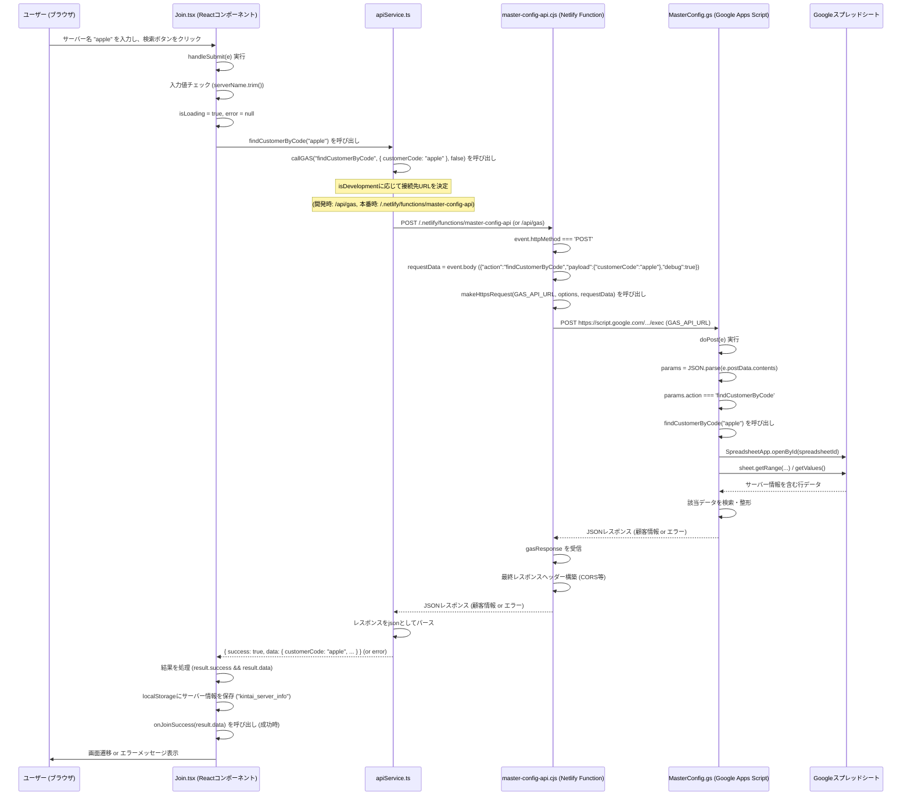

# サーバー名検索処理フロー (`/join` 画面)

ユーザーが `/join` 画面でサーバー名（例: `apple`）を入力し、「サーバーを検索」ボタンをクリックした際の処理フローを図解します。

## 各コンポーネントの役割

1.  **ユーザー (ブラウザ)**
    *   サーバー名を入力し、検索アクションをトリガーします。
2.  **`Join.tsx` (Reactコンポーネント)**
    *   ユーザーからの入力を受け付けます。
    *   入力値のバリデーションを行います。
    *   `apiService.ts` の `findCustomerByCode` 関数を呼び出してサーバー情報の検索を依頼します。
    *   APIからのレスポンスに基づき、成功時は `onJoinSuccess` コールバックを実行して親コンポーネントに情報を渡し、失敗時はエラーメッセージを表示します。
    *   ローカルストレージ (`kintai_server_info`) に取得したサーバー情報を保存します。
3.  **`apiService.ts`**
    *   `findCustomerByCode` 関数が呼び出されます。
    *   内部的に `callGAS` 関数を呼び出します。
    *   `callGAS` 関数は、開発環境か本番環境かに応じて、Netlify Function (`/.netlify/functions/master-config-api`) またはローカルプロキシ (`/api/gas`) にPOSTリクエストを送信します。
    *   リクエストボディには `{ action: "findCustomerByCode", payload: { customerCode: "apple" } }` のようなJSON文字列が含まれます。
    *   レスポンスを処理し、`Join.tsx` に結果を返します。
4.  **`master-config-api.cjs` (Netlify Function)**
    *   フロントエンドからのAPIリクエストのプロキシとして機能します。
    *   POSTリクエストを受け取ると、リクエストボディをパースします。
    *   `makeHttpsRequest` 関数を使用して、Google Apps Script (`MASTER_CONFIG_GAS_API_URL`) にHTTPSリクエストを転送します。
    *   GASからのレスポンスに必要なCORSヘッダーなどを付与して、フロントエンドに返します。
5.  **`MasterConfig.gs` (Google Apps Script)**
    *   `doPost(e)` 関数がHTTP POSTリクエストを処理します。
    *   リクエストボディ (`e.postData.contents`) から `action` と `customerCode` を取得します。
    *   `action` が `findCustomerByCode` の場合、`findCustomerByCode(customerCode)` 関数を呼び出します。
    *   `findCustomerByCode` 関数は、指定された `customerCode`（サーバー名）を基に、連携するGoogleスプレッドシートを検索します。
    *   スプレッドシートから該当する顧客情報（スプレッドシートIDなど）を取得します。
    *   検索結果をJSON形式でNetlify Functionに返します。
6.  **Googleスプレッドシート**
    *   サーバー名（顧客コード）とそれに対応するスプレッドシートIDなどの顧客情報が保存されています。

## デバッグモードについて

*   `Join.tsx` では、`localStorage.getItem("kintai_debug_mode") === "true"` の場合にデバッグ情報がコンソールに出力され、画面上にも表示されます。
*   `apiService.ts` の `callGAS` 関数も `DEBUG_MODE()` がtrueの場合、リクエストボディに `debug: true` を追加します。
*   Netlify Function (`master-config-api.cjs`) および GAS (`MasterConfig.gs`) にも、詳細なデバッグログを出力する処理が追加されています（直近の修正）。これらのログはNetlifyのFunctionログやGoogle CloudのApps Scriptログで確認できます。